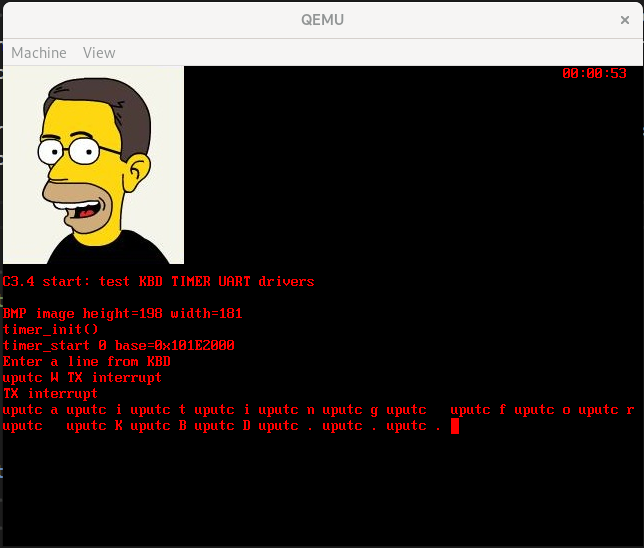
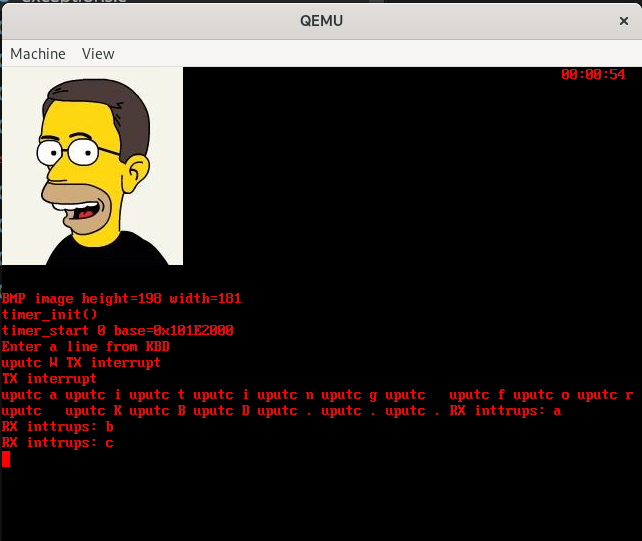
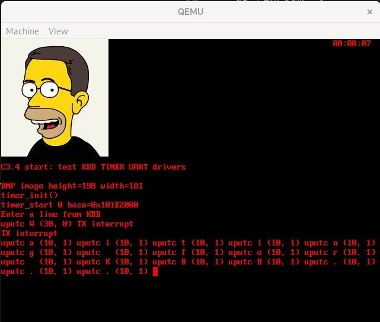

# Lecture Homework Week 07 - Tuesday

For this lecture homework, you will explore the interrupt-driven UART device driver and how to create a simple logging interface.

## Getting the Code

As with the previous lecture homework, this assignment is hosted on GitHub. Create your own repository using the assignment repository as a template. To do this:

1. Click on **"Use this template."**
2. Select **"Create a new repository."**
3. Give your repository a descriptive name.
4. Click **"Create repository."**

Once created, clone the repository or open it in a GitHub Codespace to begin working.

## Adding Your Logo

If you attempt to compile the program immediately after cloning, it will fail with the following error:

```bash
mkdir build
cmake -S . -B build
cmake --build build
...
arm-none-eabi-objcopy: '../image0.bmp': No such file
...

```

This occurs because no image is included in the repository to act as your OS logo. You must provide your own logo (`image0.bmp`). Convert your chosen image to BMP format if it isn't already.

**Requirements:**

1. The image must be an appropriate size to fit on the display.
2. The image must be a **new** image (not the same `image0.bmp` used in the previous lab).

## Running the Code

Compile the project as you have done previously and run it using QEMU:

```bash
qemu-system-arm -M versatilepb -m 128M -kernel build/uart-int.bin -serial mon:stdio

```

## The Keyboard & UART Demo

The code allows you to type text into the QEMU Graphical User Interface (GUI). Click inside the QEMU window and start typing. You should see keyboard events appear on the screen until you press the **Enter** key, at which point the entire text string is printed.

You should see something like this:



### Let's Fix It

As described in lecture, the UART code from the book does not work. As you will observe, no text shows up in the terminal. This text usually comes from UART0; however, only the very first letter sent is ever displayed.

The following text from the terminal shows this situation:

```bash
[W][63731.858454] pw.conf      | [          conf.c: 1031 try_load_conf()] can't load config client.conf: No such file or directory
[E][63731.859383] pw.conf      | [          conf.c: 1060 pw_conf_load_conf_for_context()] can't load config client.conf: No such file or directory
pulseaudio: set_sink_input_volume() failed
pulseaudio: Reason: Invalid argument
pulseaudio: set_sink_input_mute() failed
pulseaudio: Reason: Invalid argument
W

```

The very last character "W" is displayed, but no other characters after that. The following tasks will help us to find the issue and fix it. In the last lecture homework, we used GDB. In this homework, we will use log messages, or so-called "printf debugging", to find the issue.

Several log messages are already added to the code, and all print out to the QEMU display screen. We see these messages in the following screenshot:




In this screenshot, we see several log messages. The messages all come from code in [`src/uart_int.c`](src/uart_int.c). The `TX interrupt` messages are in the function `do_tx`, just as `RX Interrupt` comes from the function `do_rx`. These log messages indicate that the IRQ handler has fired and the correct interrupt handler has been called. The other log messages come from the `uputc` function. These messages indicate that this function has been called to send a character that has been typed into the display to the terminal via UART0. Type more characters into the display and see how more log messages appear.

What we can understand about the UART device driver is that while `uputc` is getting called, the `do_tx` function is only called twice and then never again. If the IRQ handler were working correctly, you would see a `TX Interrupt` message for each character typed and then displayed in the terminal.

We need some more information to figure out the issue causing the TX interrupt to only be called once. Take a look at the function `uputc` below:

```c
int uputc(UART* up, char c) { // output a char to UART
  printf("uputc %c ", c);
  if (up->txon) {  // if TX is on, enter c into outbuf[]
    up->outbuf[up->outhead++] = c;
    up->outhead %= 128;
    lock();
    up->outdata++;
    up->outroom--;
    unlock();
    return 0;
  }

  // txon==0 means TX is off => output c & enable TX interrupt
  // PL011 TX is triggered only if write char, else no TX interrupt
  int i = *(up->base + UFR);         // read FR
  while (*(up->base + UFR) & 0x20);  // loop while FR=TXF
  *(up->base + UDR) = (int)c;        // write c to DR
  *(up->base + IMSC) |= 0x30;        // 0000 0000: bit5=TX mask bit4=RX mask
  up->txon = 1;
}

```

Simply put, this method adds each character to the output buffer if `txon` is 1; otherwise, it waits until the transmit buffer is empty before putting the character in the `UDR` register for the UART driver to send, and then turns on the interrupt mask to cause `do_tx` to be called. Finally, it sets `txon` to 1. Let's add the value of the `IMSC` register and the value of `txon` to our log messages for `uputc`.

The following code does that:

```c
  printf("uputc %c (%x, %x) ", c, *(up->base + IMSC), up->txon);

```

When you recompile and run this code, you should see something like the following:




This screenshot shows that during the first call to `uputc`, the `IMSC` is set to 0x30, meaning the transmit interrupt is enabled, and that `txon` is 0. However, for every other call to `uputc`, the transmit interrupt is off (`IMSC` is 0x10) and `txon` is 1. So what we see happening is that the `txon` remains 1, meaning that the characters are constantly added to the output buffer, and the transmit interrupt is never enabled again. This is the source of the issue we are observing.

Luckily, the fix is simple. Move the code `up->txon = 1` in `uputc` into `do_tx`, as shown below:

```c
int do_tx(UART* up) { // TX interrupt handler
  char c;
  printf("TX interrupt\n");
  if (up->outdata <= 0) {       // if outbuf[ ] is empty
    *(up->base + IMSC) = 0x10;  // disable TX interrupt
    up->txon = 0;               // turn off txon flag
    return -1;
  }

  c = up->outbuf[up->outtail++];
  up->outtail %= SBUFSIZE;
  *(up->base + UDR) = (int)c;  // write c to DR
  up->txon = 1;
  up->outdata--;
  up->outroom++;
  return 0;
}

```

Compile and re-run the program. We should now see that the keyboard IRQ handler is properly sending the characters over UART to the terminal, and the entire message is printed, as shown below:

```bash
[E][65675.125237] pw.conf      | [          conf.c: 1060 pw_conf_load_conf_for_context()] can't load config client.conf: No such file or directory
pulseaudio: set_sink_input_volume() failed
pulseaudio: Reason: Invalid argument
pulseaudio: set_sink_input_mute() failed
pulseaudio: Reason: Invalid argument
Waiting for KBD...

```

The last line `Waiting for KBD...` is properly printed.

## Cleaning up the Display

Now that we have fixed the UART IRQ handler, let's clean up the display and terminal by using another UART instance to send log messages to. When we execute the QEMU emulator, we add the argument `-serial mon:stdio`. This argument maps UART0 to the terminal. Subsequent `-serial` flags map to the other UART instances UART1, UART2, and UART3. So the following command maps UART0 as usual, but then also maps UART1 to a TCP connection that we can follow in the serial monitor:

```bash
qemu-system-arm -M versatilepb -m 128M -kernel build/uart-int.bin -serial mon:stdio -serial telnet:localhost:4444,server

```

Type this command into the terminal. The QEMU display does not come up immediately. Instead, you should see the following message:

```bash
qemu-system-arm: -serial telnet:localhost:4444,server: info: QEMU waiting for connection on: disconnected:telnet:127.0.0.1:4444,server=on

```

Go to the Serial Monitor tab of VS Code, and for Monitor Mode select TCP. Then set Host to `localhost` and Port to `4444` and press Start Monitoring. Once you press this button, the QEMU GUI will be displayed.

### Adding a Logging Function

The problem with the debugging we did to find this problem is that it polluted the QEMU display with messages, making it hard to see what the program actually does. In this homework, we will add a log function that allows us to log messages to UART1 and keep the other outputs clean.

This new functionality is in the files `log.h`, `log_config.h`, and `log.c`. The `log.h` file defines all the macros necessary to do log debugging messages. Instead of using `printf` or `uprintf`, we can use macros such as `LOG_ERROR`, `LOG_WARN`, `LOG_DEBUG`, and `LOG_INFO`. These macros are in order of priority of the message, from the highest (`ERROR`) to the lowest (`INFO`). We can filter these log messages based on priority and turn them off completely without adding code to the executable.

The file `log_config.h` sets both the UART instance and the log level for filtering. The one provided here is as follows:

```c
#ifndef __LOG_CONFIG_H__
#define __LOG_CONFIG_H__

// Set up debug messages
#define LOG_UART_INDEX 1
#define LOG_LEVEL_MAX 4
#include "log.h"

#endif

```

The macro `LOG_UART_INDEX 1` sets the output of the log messages to UART1. The next macro, `LOG_LEVEL_MAX 4`, sets the priority to the lowest level, `INFO`. This means that none of the log messages are filtered, and all are printed to UART1. If, instead, we used the macro `LOG_LEVEL_MAX 3`, this would filter only `INFO` level messages out and print all others. As the maximum log level is lowered, only the priorities of those levels and higher are printed. All others are filtered out.

The code for the macros is given, as is the implementation of the `log_message` function that actually sends the messages to the UART logger. Only one more change is necessary to make the system work properly. Replace the implementation of `uprintf` in `src/uart_int.c` with the following code:

```c
int uprintf(UART* up, const char* fmt, ...) {
  va_list args;  // ip points to first item in stack
  va_start(args, fmt);
  vuprintf(up, fmt, args);
  va_end(args);
}

int vuprintf(UART* up, const char* fmt, va_list args) { 
  const char* cp = fmt;            // cp points to the fmt string
  while (*cp) {              // scan the format string
    if (*cp != '%') {        // spit out ordinary chars
      uputc(up, *cp);
      if (*cp == '\n')    // for each '\n'
        uputc(up, '\r');  // print a '\r'
      cp++;
      continue;
    }
    cp++;           // cp points at a conversion symbol
    switch (*cp) {  // print item by %FORMAT symbol
      case 'c':
        uputc(up, va_arg(args, int));
        break;
      case 's':
        uprints(up, va_arg(args, char *));
        break;
      case 'u':
        uprintu(up, va_arg(args, int));
        break;
      case 'd':
        uprintd(up, va_arg(args, int));
        break;
      case 'x':
        uprintx(up, va_arg(args, int));
        break;
    }
    cp++;
  }
}
```

Also, add the inclusion `#include <stdarg.h>` to the top of `uart_int.c` to make everything compile. Once you've added this code, change all the `printf` calls in `kbd.c` to `LOG_INFO` and remove the `printf` function calls from `uart_int.c`. Do not change these to `LOG_INFO`. This will cause a stack overflow. Next, recompile and run the program. Finally, add the inclusion `#include "log_config.h"` to both files to properly configure the logger for use in these files.

Take a screenshot of the QEMU display and also a screenshot that shows the output of the logger in the Serial Monitor. Save both of these screenshots in `assets/`.

## What to Turn In

**Modified Files:**

* `src/kbd.c` and `src/uart_int.c`
* `assets/` (containing your QEMU and Serial Monitor screenshots)
* `image0.bmp` (with your logo so it will compile on Gradescope)

**Submission Steps:**

1. Commit and push all changes to GitHub.
2. Submit the assignment via **Gradescope**.
3. Select your repository when prompted.
